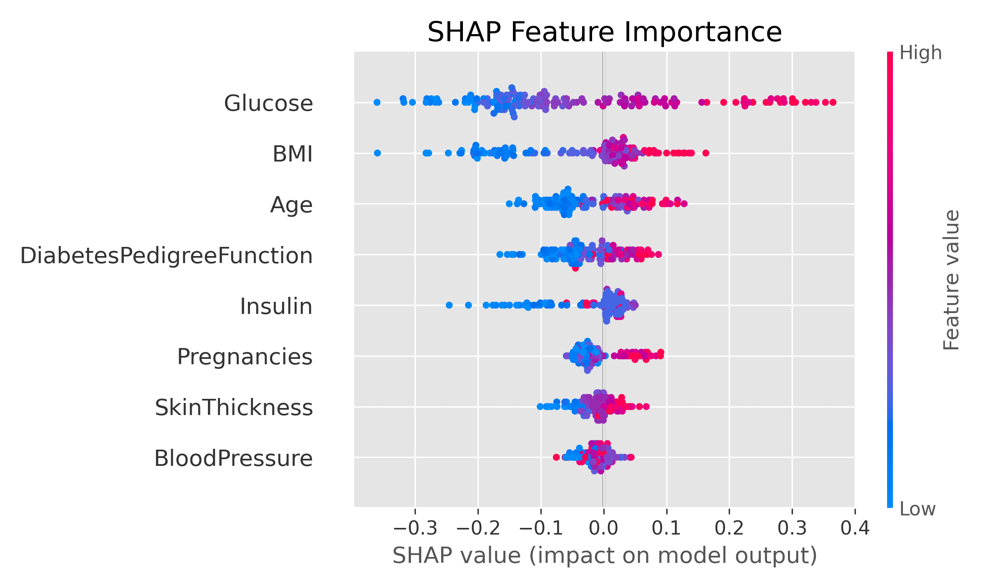
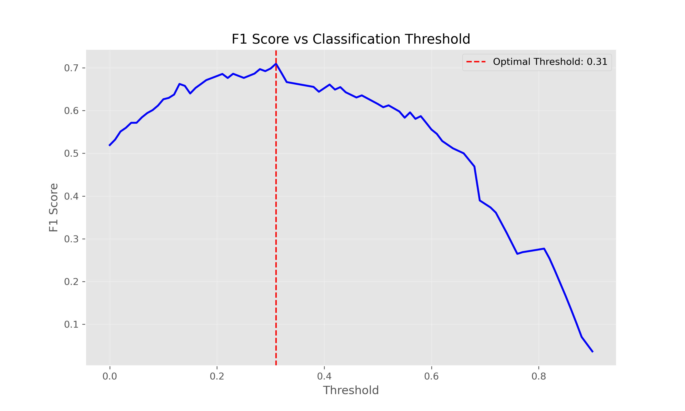
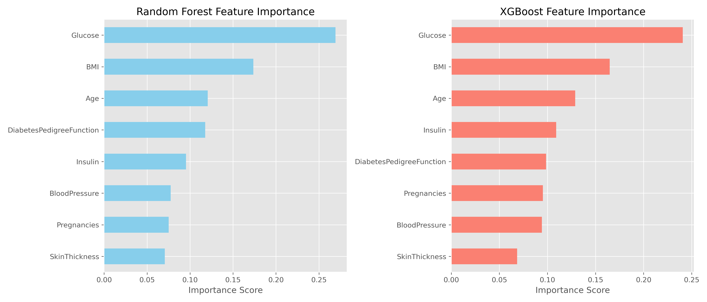
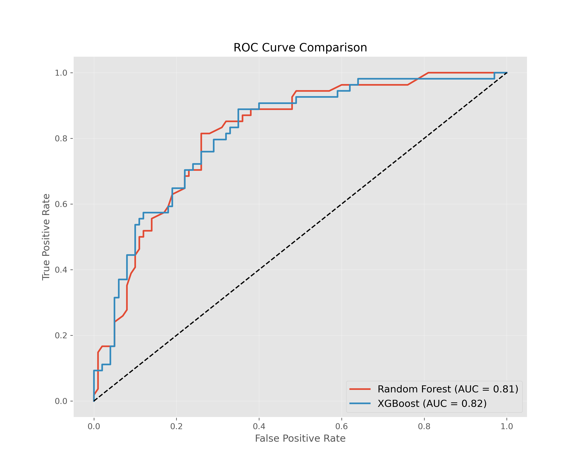

# Clinical-Diabetes-Risk-Assessment-with-Interpretable-Machine-Learning

[](https://harsh782patel-clinical-diabete-diabetes-streamlit-appapp-d8l0bl.streamlit.app/)

  
*Example of model interpretability using SHAP values*

## Overview
This project develops a machine learning system to predict diabetes risk using clinical measurements from the Pima Indians Diabetes dataset. The solution focuses on interpretability and clinical relevance, providing not just predictions but also explanations for each prediction to support medical decision-making.

**Live Deployment**: [Clinical Diabetes Risk Assessment App](https://harsh782patel-clinical-diabete-diabetes-streamlit-appapp-d8l0bl.streamlit.app/)

**Key Features**:
- **Clinical Web Application**: Interactive Streamlit dashboard for risk assessment
- **Interpretable AI**: SHAP values for prediction explanations
- **Clinical Recommendations**: Personalized guidance based on risk level
- **BMI Calculator**: Integrated tool for body mass index calculation
- **Deployment-Ready Pipeline**: End-to-end processing from raw data to prediction

**App Screenshot**:  
  
*Interactive clinical dashboard for diabetes risk assessment*

[](#)
[](#)
[](#)
[](#)
[](#)
[](#)
[](https://opensource.org/licenses/MIT)

## Features

### Clinical Web Application
- **Interactive Dashboard**: User-friendly interface for clinical data entry
- **Risk Visualization**: Medical-grade risk assessment scale
- **BMI Calculator**: Built-in tool to calculate body mass index
- **Clinical Definitions**: Detailed explanations of medical parameters
- **Personalized Recommendations**: Actionable guidance based on risk level
- **Cloud Deployment**: Accessible via web browser

### Machine Learning
- **Clinical Feature Engineering**: Domain-specific feature creation like Glucose-BMI interaction
- **Interpretable AI**: SHAP values for prediction explanations
- **Threshold Optimization**: Balanced precision/recall for medical context
- **Deployment-Ready Pipeline**: End-to-end processing from raw data to prediction
- **Model Comparison**: Random Forest vs. XGBoost vs. Ensemble methods
- **Comprehensive Evaluation**: ROC curves, precision-recall analysis, feature importance

## Installation

1. Clone repository:
```bash
git clone https://github.com/harsh782patel/Clinical-Diabetes-Risk-Assessment-with-Interpretable-Machine-Learning.git
cd Clinical-Diabetes-Risk-Assessment-with-Interpretable-Machine-Learning
```
> **Note**: Dataset contains biologically implausible zeros (e.g., Glucose=0). These are automatically handled as missing values during preprocessing.

2. Install dependencies:
```bash
pip install -r requirements.txt
```

## Usage
### Using the Deployed Application
Access the live clinical dashboard directly:
[Clinical Diabetes Risk Assessment App](https://harsh782patel-clinical-diabete-diabetes-streamlit-appapp-d8l0bl.streamlit.app/)

The application provides:
- Interactive input of clinical parameters
- Real-time diabetes risk assessment
- Visual risk scale with color-coded categories
- Clinical recommendations based on risk level
- Feature importance analysis

### Running Locally
Launch the clinical dashboard:
```bash
cd diabetes-streamlit-app
streamlit run app.py
```

### Running the Full Analysis
Execute the Jupyter notebook for complete EDA, modeling and evaluation:
```bash
jupyter notebook notebooks/Diabetes_Prediction.ipynb
```

### Making Predictions
Use the trained model to assess diabetes risk:

```python
from src.predict import predict_diabetes

# Sample patient data: [Pregnancies, Glucose, BP, SkinThickness, Insulin, BMI, DPF, Age]
patient_data = [7, 159, 64, 29, 125, 27.4, 0.294, 40]

risk_score = predict_diabetes(patient_data)
print(f"Diabetes probability: {risk_score:.1%}")

# Output: Diabetes probability: 76.0%

```

### Training from Scratch
Retrain the model with custom parameters:
```bash
python src/train.py --n_estimators 300 --max_depth 15
```

## Key Results
### Web Application Features
 
*Clinical dashboard with (A) input parameters, (B) risk visualization, (C) recommendations*

### Model Performance Comparison
| Model          | ROC-AUC | Accuracy | Precision | Recall | F1-Score |
|----------------|---------|----------|-----------|--------|----------|
| **XGBoost**    | 0.85    | 0.79     | 0.76      | 0.78   | 0.77     |
| Random Forest  | 0.83    | 0.79     | 0.74      | 0.75   | 0.75     |

### Optimal Decision Threshold
  
*Optimal decision threshold at 0.31 balances precision (0.63) and recall (0.81)*

### Feature Importance
  
*Glucose levels, BMI, and Age are the strongest predictors of diabetes risk*

### ROC Curve Comparison
  
*XGBoost shows marginally better performance than Random Forest*

## Contributing

Contributions are welcome! Please follow these steps:
1. Fork the project
2. Create your feature branch (`git checkout -b feature/AmazingFeature`)
3. Commit your changes (`git commit -m 'Add some AmazingFeature'`)
4. Push to the branch (`git push origin feature/AmazingFeature`)
5. Open a Pull Request

## License
Distributed under the MIT License. See `LICENSE` for more information.
